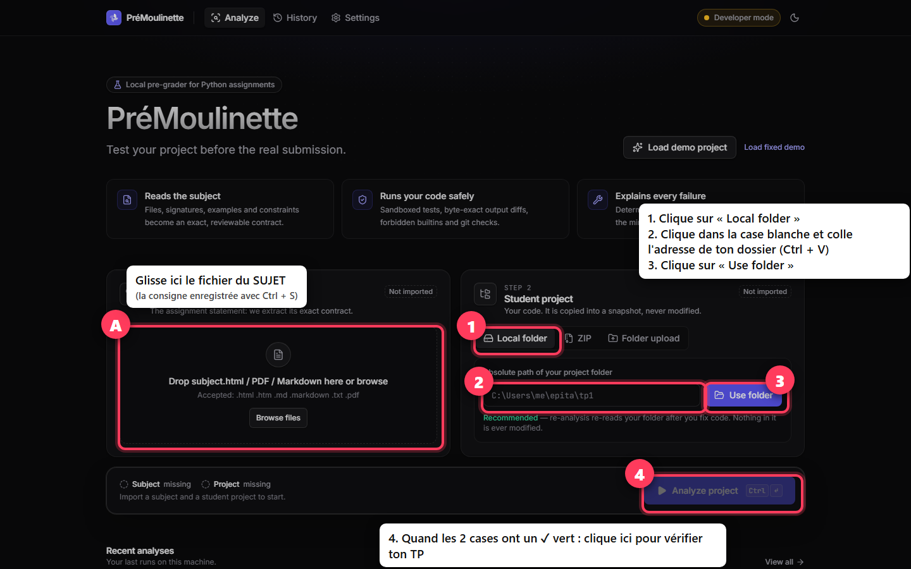

# PréMoulinette, expliquée simplement

Ce guide est pour toi si tu **n'y connais rien en informatique**. Lis-le dans l'ordre, sans sauter d'étape.

---

## C'est quoi, PréMoulinette ?

Imagine que tu dois rendre un devoir, et que le prof le corrige avec une **machine très stricte**.
Cette machine met une erreur pour un espace en trop, une lettre oubliée, un fichier mal rangé…
Et tu n'as droit qu'à **quelques essais** pour rendre ton devoir.

**PréMoulinette, c'est un ami qui relit ton devoir AVANT que tu le rendes.**
Il compare ton travail avec la consigne et te montre chaque erreur, avec une explication.
Tu corriges, il relit, autant de fois que tu veux, **gratuitement et sans utiliser tes essais**.

Il ne donne pas la note officielle : il te dit seulement si ton travail respecte la consigne.

---

## Les mots que tu vas voir

| Mot | Ce que ça veut dire |
|---|---|
| **Le sujet** | La consigne du TP : la page qui explique ce qu'il faut faire. |
| **Ton projet / ton travail** | Le dossier sur ton ordinateur qui contient les fichiers de ton TP. |
| **Le chemin d'un dossier** | L'« adresse » d'un dossier sur l'ordinateur, par exemple `C:\Users\Lea\Documents\mon-tp`. |
| **Le navigateur** | Le programme qui sert à aller sur internet : Chrome, Edge, Firefox, Opera… |
| **Installer** | Mettre un programme sur ton ordinateur, une seule fois. |

---

# Partie 1 : Préparer l'ordinateur (une seule fois)

Tu le fais **une seule fois**. Ensuite, tu n'y touches plus.

### Étape 1 : installer Python
Python est le langage de programmation des TP. PréMoulinette en a besoin pour fonctionner.

1. Va sur **https://www.python.org/downloads/**
2. Clique sur le gros bouton jaune **« Download Python »**.
3. Ouvre le fichier téléchargé (en bas du navigateur, ou dans le dossier **Téléchargements**).
4. ⚠️ **TRÈS IMPORTANT** : sur la première fenêtre, **coche la case tout en bas « Add python.exe to PATH »**.
5. Clique sur **« Install Now »** et attends la fin, puis clique sur **« Close »**.

### Étape 2 : installer Node.js
Node.js sert à afficher PréMoulinette dans ton navigateur.

1. Va sur **https://nodejs.org**
2. Clique sur le bouton **« LTS »**, celui de gauche ou celui qui est recommandé.
3. Ouvre le fichier téléchargé et clique sur **« Suivant »** jusqu'au bout, puis **« Terminer »**.

### Étape 3 (recommandé) : installer Docker Desktop
Docker est une **boîte fermée** : PréMoulinette y fait tourner ton TP pour qu'il ne puisse rien abîmer
sur ton ordinateur. Tu peux t'en passer (voir [la fin du guide](#je-ne-veux-pas-installer-docker)), mais c'est plus sûr avec.

1. Va sur **https://www.docker.com/products/docker-desktop/** et clique **« Download for Windows »**.
2. Ouvre le fichier téléchargé et laisse-le s'installer. **Redémarre l'ordinateur** s'il te le demande.
3. Ouvre **Docker Desktop**, depuis le menu Démarrer.
4. Clique sur **« Accept »** pour accepter la licence (gratuite pour un étudiant).
   S'il te demande de créer un compte, clique sur **« Skip »** (passer).

### Étape 4 : télécharger PréMoulinette
1. Va sur **https://github.com/Ilyes631/premoulinette**
2. Clique sur le bouton vert **« Code »**, puis sur **« Download ZIP »**.
3. Ouvre ton dossier **Téléchargements**. Tu y trouves `premoulinette-main.zip`.
4. Fais un **clic droit** dessus, puis **« Extraire tout… »**, puis **« Extraire »**.
5. Un dossier **`premoulinette-main`** apparaît. Tu peux le glisser sur ton **Bureau** pour le retrouver facilement.

### Étape 5 : premier démarrage
1. Ouvre le dossier **`premoulinette-main`**.
2. **Double-clique** sur le fichier **`start`**. Il peut s'appeler `start.bat`, avec un engrenage comme icône.
3. Si une fenêtre bleue dit *« Windows a protégé votre ordinateur »* : clique sur **« Informations complémentaires »**,
   puis sur **« Exécuter quand même »**. C'est normal : Windows ne connaît pas encore ce programme.
4. Une **fenêtre noire** s'ouvre avec du texte qui défile. **Ne la ferme pas.**
   La première fois, elle installe tout ce qu'il faut : **ça prend environ 5 minutes.**
5. À la fin, ton navigateur s'ouvre tout seul sur PréMoulinette. 🎉

L'ordinateur est prêt. Tu ne refais plus jamais la Partie 1.

---

# Partie 2 : Vérifier ton TP (à chaque fois)

### Étape 1 : ouvrir PréMoulinette
1. Si tu as installé Docker, ouvre d'abord **Docker Desktop** et attends qu'il soit prêt (environ 1 minute).
2. Ouvre le dossier **`premoulinette-main`** et **double-clique** sur **`start`**.
3. La fenêtre noire s'ouvre : **ne la ferme pas** tant que tu utilises PréMoulinette.
4. Ton navigateur s'ouvre tout seul après environ 10 secondes. Sinon, tape **`localhost:5173`** dans la barre
   d'adresse de ton navigateur, puis Entrée.

Tu vois cette page, avec **deux grandes cases** :

### Étape 2 : enregistrer le sujet sur ton ordinateur
1. Ouvre la page du **sujet** de ton TP, sur le site de ton école.
2. Appuie en même temps sur les touches **Ctrl** et **S**.
3. Une fenêtre « Enregistrer sous » s'ouvre. En bas, dans **« Type »**, choisis **« Page Web, HTML uniquement »**.
4. Choisis le dossier **Téléchargements** et clique **« Enregistrer »**.

*Si ton sujet est un fichier PDF, télécharge-le simplement.*

### Étape 3 : donner le sujet à PréMoulinette
1. Ouvre ton dossier **Téléchargements** à côté de ton navigateur.
2. **Attrape** le fichier du sujet avec la souris et **dépose-le** dans la **case de gauche** (« Subject »).
3. La case affiche le nom du TP et un ✓ vert. C'est bon.

### Étape 4 : donner ton travail à PréMoulinette
Il faut dire à PréMoulinette **où est le dossier de ton TP**. Voici où cliquer (A = le sujet de l'étape 3,
puis **1 → 2 → 3** pour ton travail, puis **4** pour lancer) :

1. Ouvre le dossier de ton TP, comme quand tu cherches un fichier.
2. Clique **une fois** dans la **barre d'adresse**, tout en haut de la fenêtre du dossier.
   Elle devient bleue et affiche l'adresse du dossier, par exemple `C:\Users\Lea\Documents\mon-tp`.
3. Appuie sur **Ctrl** + **C** pour copier cette adresse.
4. Dans PréMoulinette, dans la **case de droite** (« Student project »), clique dans le champ de texte.
5. Appuie sur **Ctrl** + **V** pour coller, puis clique sur **« Use folder »**.

> **Ton TP est dans Ubuntu ?** Dans la fenêtre Ubuntu, va dans le dossier de ton TP, puis tape
> `explorer.exe .` (n'oublie pas le point) et appuie sur Entrée. Une fenêtre de dossier normale s'ouvre :
> fais ensuite les points 2 à 5 ci-dessus.

### Étape 5 : lancer la vérification
1. Clique sur le gros bouton **« Analyze project »**, en bas.
2. Attends environ 30 secondes. Tu vois les étapes se cocher une par une.
3. Le résultat s'affiche :

- 🔴 **DO NOT SUBMIT YET** veut dire « ne rends pas encore » : il reste des erreurs.
- 🟢 **READY TO SUBMIT** veut dire « prêt à rendre » : tout ce qui peut être vérifié est bon.
- Le **pourcentage** montre où tu en es. Le but, c'est 100 %.

### Étape 6 : voir et comprendre les erreurs
1. Clique sur l'onglet **« Issues »** (les problèmes). Les erreurs sont rangées par fichier.
2. Clique sur une erreur. Un panneau s'ouvre à droite :

- **EXPECTED** = ce que la consigne demande.
- **RECEIVED** = ce que ton programme fait vraiment.
- Les petites flèches **^** montrent **exactement** où est la différence, même un simple espace.
- **« Explain »** t'explique le problème avec des mots simples.
- **« How to fix »** te montre la petite correction à faire.

> Commence par les erreurs marquées **Critical** (graves).

### Étape 7 : corriger et revérifier
1. Corrige ton TP **comme d'habitude**, dans ton éditeur de code.
2. Reviens sur PréMoulinette et clique sur **« Re-analyze »**, en haut à droite.
3. Recommence jusqu'à voir 🟢 **READY TO SUBMIT**.

### Étape 8 : rendre ton TP
PréMoulinette **ne rend jamais ton travail à ta place**. Quand tout est vert, rends ton TP
**comme ton école te l'a appris** (avec `git push` et le tag demandé dans le sujet).

### Pour fermer PréMoulinette
Ferme simplement la **fenêtre noire**. C'est tout.

---

# Si ça ne marche pas

| Ce que tu vois | Ce que tu fais |
|---|---|
| La fenêtre noire dit **« Node.js n'est pas installé »** | Refais l'**Étape 2** de la Partie 1, puis double-clique à nouveau sur `start`. |
| La fenêtre noire parle de **Python** | Refais l'**Étape 1** en n'oubliant pas de **cocher « Add python.exe to PATH »**. |
| Le navigateur dit **« Impossible de se connecter »** | Attends encore 10 secondes, puis appuie sur **F5** pour recharger. |
| Message **« Docker is not available »** | Ouvre **Docker Desktop** et attends 1 minute, ou lis la partie juste en dessous. |
| Une erreur te semble fausse | Clique sur **« Review extracted requirements »** pour voir ce que PréMoulinette a compris du sujet. Tu peux corriger avec **« Edit »**. |

## Je ne veux pas installer Docker
1. Dans PréMoulinette, clique sur **Settings** (réglages), en haut.
2. Coche la case **« I understand the risks and allow Developer mode on this machine »**.
3. Clique sur **« Save settings »**.

Ton TP sera alors vérifié directement sur ton ordinateur. C'est sans danger pour **ton propre** travail.

## Explications par intelligence artificielle (pas obligatoire)
PréMoulinette marche **très bien sans**. Si tu veux quand même des explications écrites par l'IA Claude,
il faut une « clé » payante (quelques centimes par explication) :
1. Crée un compte sur **https://console.anthropic.com**, puis ajoute un peu d'argent dans **Billing**.
2. Va dans **API Keys**, clique sur **Create Key** et copie la clé (elle commence par `sk-ant-`).
3. Dans PréMoulinette, va dans **Settings**, partie **AI explanations** : active-la, colle ta clé, puis **Save settings**.

---

*Sur Mac ou Linux : au lieu de double-cliquer sur `start`, ouvre un terminal dans le dossier et tape `./start.sh`.*
