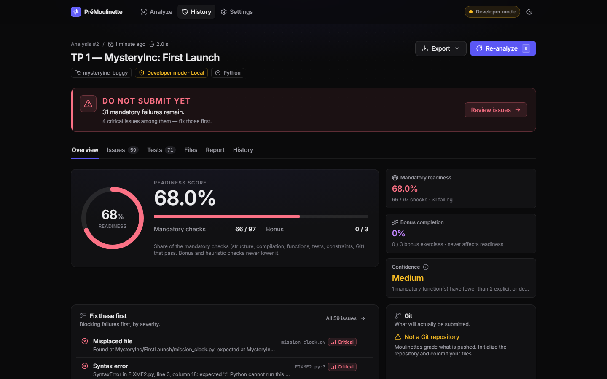
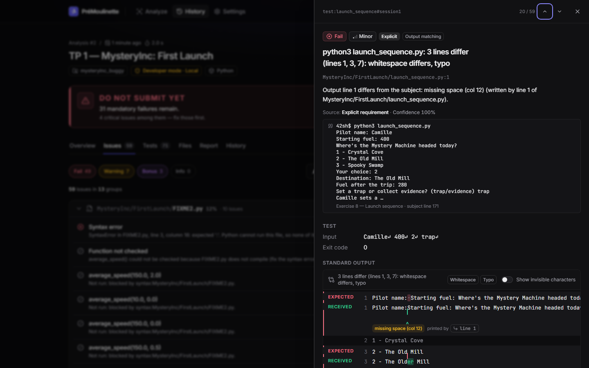
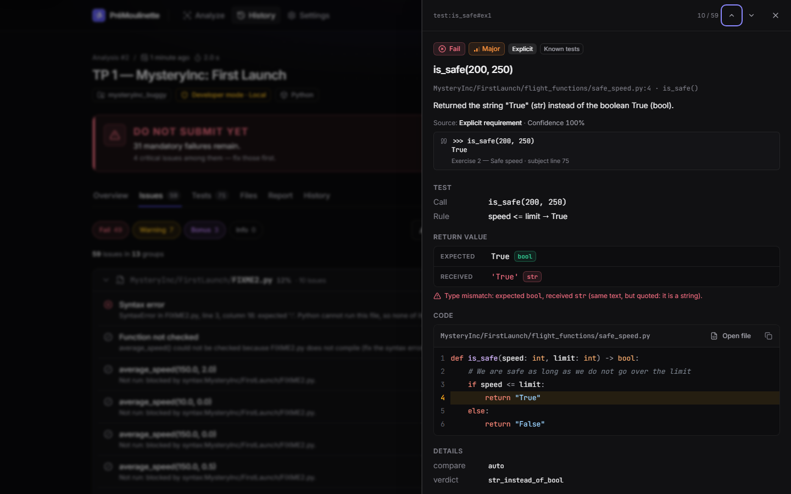
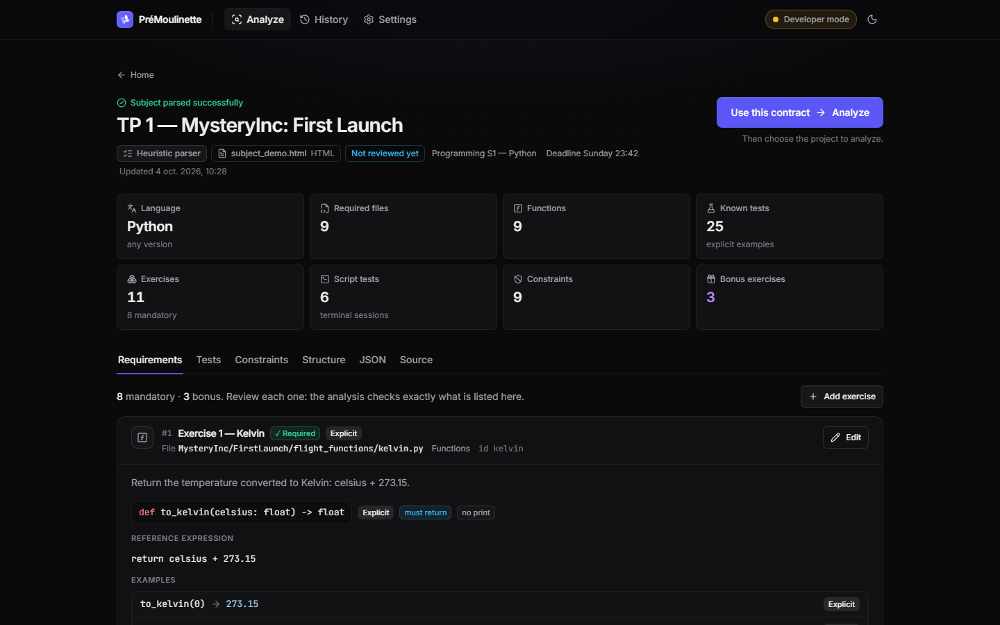
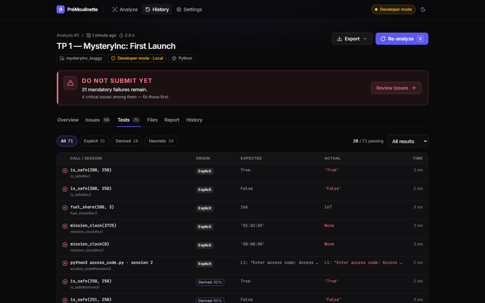
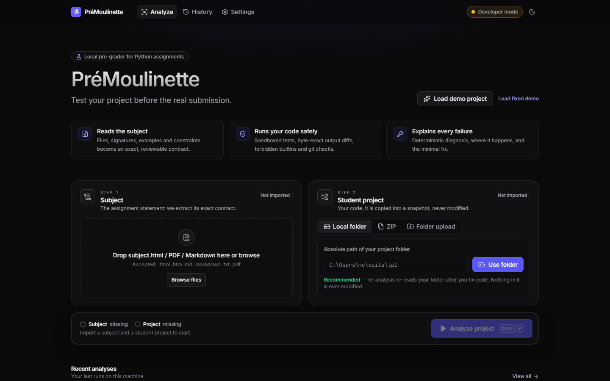

# PréMoulinette

**Test your project before the real submission.**

PréMoulinette is a local pre-grader for programming assignments (TPs). You give it the assignment
subject and your project. It works out what the subject requires, runs deterministic checks and
sandboxed tests on your code, and shows a **Readiness Score** with precise, clickable diagnostics.
You can then fix your code and re-analyze as often as you like without spending one of your limited
`submit-*` tags.

> The Readiness Score is **not an official grade**. PréMoulinette only checks what can be verified
> from the subject. The real grader may have hidden tests.

---

## What it does

| Step | What happens | How |
|---|---|---|
| 1. Import the subject | HTML, Markdown, TXT or PDF | `subject/extract*` builds a structured document (headings, code blocks, user inputs marked with `<kbd>`) |
| 2. Understand it | Builds a **PracticalSpec**: files, functions and signatures, rules, examples, interactive sessions, prompts, allowed/forbidden builtins, bonus vs. mandatory | Deterministic heuristic parser, plus an optional AI parser (Claude, opt-in) whose output is *grounded* against the subject text |
| 3. Review it | You can read and **edit** the extracted contract in the UI (structured form or raw JSON) | Edited items are marked `user` |
| 4. Import your project | Local folder path (recommended, enables one-click re-analysis), ZIP, or folder upload | Always copied into a snapshot, never analyzed in place |
| 5. Analyze | Structure, compilation, AST, constraints, explicit/derived/heuristic tests, exact output comparison, Git state | Code checks plus an **isolated sandbox** |
| 6. Understand the errors | Character-level diffs with invisible characters shown, expected vs. received values with types, the exact source line | `compare/text_diff`, harness I/O instrumentation |
| 7. Fix | **Explain**, **How to fix** (minimal patch, never applied automatically), **Show expected behavior** | Offline templates in French and English; optional AI explanation that sends only a minimal payload you can preview |
| 8. Track | History and comparison between analyses ("+6 tests fixed, −1 new failure"); export to JSON, Markdown or HTML | SQLite, stored locally |

What it detects, with a precise explanation for each:

- missing or misplaced files (also case-only differences, which Windows hides)
- parasite files (`__pycache__`, `.DS_Store`…) and a missing `.gitignore`
- syntax and indentation errors, with line and column
- missing functions and near-miss names (`is_save` → `is_safe`)
- wrong parameter count, and functions that `print` instead of `return`
- `"True"` (str) returned instead of `True` (bool)
- wrong values, at subject examples and at rule boundaries (`speed == limit`)
- output differing by a single character (`callect`, `The Older Mill`, a missing trailing space), mapped to the exact source line
- wrong `input()` prompts
- forbidden or non-authorized builtins, including bypasses (`f = abs`, `__builtins__`)
- forbidden imports and constructs
- code executed at import time
- timeouts, crashes, `EOFError`
- files not tracked by Git (they would not be submitted) and a dirty working tree

### Test provenance

Every check states where it comes from:

| Origin | Meaning | Effect on score |
|---|---|---|
| **Explicit** | Literally in the subject (example, signature, listed file, session) | Mandatory |
| **Derived** | Deduced deterministically from an explicit rule, e.g. the boundary `vertical_speed == 2` of `vertical_speed <= 2` | Mandatory |
| **Heuristic** | Extra case proposed by the system (0, −1, large values…) | Warning only, never presented as official |
| **AI-extracted** | Found by the AI parser but not verbatim in the subject | Flagged "needs review" |

### Scores

- **Mandatory readiness**: the percentage of verifiable mandatory checks that pass. Bonus items never count here.
- **Bonus completion**: a separate score for bonus exercises.
- **Confidence** (High / Medium / Low): how much the analysis can be trusted, with the reasons (unreviewed AI items, few tests per function, heuristic warnings…).
- **Verdict**: `READY TO SUBMIT` only when no mandatory check fails. Otherwise `DO NOT SUBMIT YET`.

## Screenshots

| Readiness dashboard | Output diff: missing space, `Older`, `callect`, with the source line |
|---|---|
|  |  |
| **`"True"` (str) instead of `True` (bool)** | **Extracted contract (editable)** |
|  |  |
| **Tests by origin (explicit / derived / heuristic)** | **Import screen** |
|  |  |

## Architecture

```
Subject ─▶ extraction ─▶ heuristic parser (+ optional AI parser + grounding) ─▶ PracticalSpec (editable)
                                                                                     │
Project ─▶ snapshot (copy, limits, sanitized .git) ─▶ root detection                 ▼
   ┌──────────────────────────────────────────────────────────────────────────────────────┐
   │ Structure checker · Syntax/AST analyzer · Constraint checker · Test generator          │
   │ Sandbox runner (Docker / local) · Value & output comparator · Git checker              │
   └──────────────────────────────────────────────────────────────────────────────────────┘
                     ▼ deterministic CheckResults
          Fix builder · Scoring · Report/History ─▶ AI Explanation Layer (opt-in) ─▶ Dashboard
```

```
backend/premoulinette/
  spec/        PracticalSpec (the TP contract, the core of the system) + validation
  subject/     document extraction (HTML/MD/TXT/PDF), heuristic parser, transcripts, AI parser, grounding
  project/     snapshot ingestion (folder/ZIP/upload), tree, repository-root detection, read-only Git info
  languages/   language plugins; python/ = AST analysis, structure/static checks, sandbox harness
  sandbox/     Docker (safe mode) and local (developer mode) sandboxes
  testgen/     safe expression oracle (no eval), derived and heuristic test generation
  compare/     value comparison, character-level text diff, source mapping, evaluation
  explain/     FR/EN pedagogical templates, minimal fix builder, opt-in Claude explanations
  scoring/     readiness, bonus, confidence, verdict
  report/      JSON / Markdown / HTML exports
  store/       SQLite (subjects, projects, analyses, settings)
  engine/      analysis pipeline and background jobs
  api/         FastAPI (localhost only)
frontend/      Vite + React 19 + TypeScript + Tailwind v4 + TanStack Query + Radix + motion
demo/          subject_demo.html + a buggy and a fixed student project
docs/          ARCHITECTURE.md (module contracts), DEMO_EXPECTATIONS.md
```

Design choices:

- **The deterministic core decides; the AI explains.** Pass/fail always comes from code: AST,
  exact string comparison, typed values, exit codes. The AI never grades.
- **Vite SPA instead of Next.js.** This is a local tool with no SSR or SEO needs. Vite starts
  faster, and FastAPI serves the built bundle as a single process.
- **One Python package with sub-packages** instead of many separately installed packages. The boundaries
  are the same (see `docs/ARCHITECTURE.md`) without the packaging overhead.
- **Values are stored as Python literal sources** (`"True"` vs `"'True'"`), so types survive JSON round-trips.
- **Extensible to other languages.** `languages/<lang>/` holds the analyzer, the checks and the sandbox harness.

## Requirements

- **Python 3.11+** (developed on 3.14)
- **Node.js 20+**
- **Docker Desktop** (recommended) for Safe mode. Without Docker, Developer mode is available after an explicit acknowledgement.
- Git (optional, for the Git checks)

## Installation

```bash
npm run setup
```

This creates `backend/.venv`, installs the backend (`pip install -e backend[dev]`) and the frontend dependencies.

## Quick start

```bash
npm run dev
```

Open **http://localhost:5173** and click **Load demo project**. The demo is a buggy student project for
`demo/subject_demo.html`; the expected detections are listed in `docs/DEMO_EXPECTATIONS.md`.

On Windows, `./start.ps1` does setup and dev in one command. On macOS or Linux, use `./start.sh`.

To run as a single process (built UI served by the API on http://127.0.0.1:8765):

```bash
npm run start
```

### Typical workflow

1. Drop the subject, check the extracted requirements and fix them if needed.
2. Point to your project folder.
3. Click **Analyze**, read the score and click an issue to understand it.
4. Fix your code in your editor, then click **Re-analyze**. PréMoulinette re-reads your folder.
5. When you reach `READY TO SUBMIT`, **submit manually** to your school (PréMoulinette never pushes and never creates `submit-*` tags).

## Docker

Safe mode runs every analysis in a disposable container:

```
docker run --rm --network none --read-only --tmpfs /tmp --memory 256m --cpus 1 --pids-limit 128
           --cap-drop ALL --security-opt no-new-privileges --user 65534:65534
           -v <snapshot>:/work:ro -v <harness>:/harness:ro  python:3.12-slim …
```

Install Docker Desktop, open **Settings → Sandbox**, then click **Prepare sandbox image** (`docker pull python:3.12-slim`).
In `auto` mode, PréMoulinette uses Docker whenever it is available.

## Development

```bash
npm run dev                                   # API with auto-reload + Vite HMR
backend/.venv/Scripts/python -m premoulinette # API only (127.0.0.1:8765)
npm --prefix frontend run dev                 # UI only (proxies /api)
```

The module contracts are in [`docs/ARCHITECTURE.md`](docs/ARCHITECTURE.md). The `PracticalSpec` JSON schema is served at `GET /api/spec/schema`.

## Testing

```bash
npm test                 # backend (pytest) + frontend (vitest)
npm run test:backend
npm run test:frontend
```

The test fixtures under `backend/tests/fixtures/projects/` are deliberate variants of the correct demo project:
`correct_project`, `wrong_bool_type`, `wrong_prompt`, `missing_file`, `syntax_error`, `forbidden_builtin`,
`wrong_function_name` and `missing_bonus`. Each one must produce its specific diagnosis.

## Security model

- **Student code only ever runs inside a sandbox.**
  - Safe mode (Docker): no network, read-only filesystem, project mounted read-only, memory/CPU/PID limits, all capabilities dropped, unprivileged user, container destroyed after the run.
  - Developer mode (local): a temporary copy of the project, a minimal environment (no secrets passed through), a Windows Job Object (memory, process count, kill on close) or POSIX rlimits, hard timeouts with process-tree kill, and an audit hook that blocks network access, process creation and writes outside the sandbox directory. This is weaker isolation. It is explicitly labelled and needs an acknowledgement.
- **Each test runs in a fresh process** with a timeout and an output cap.
- **Static analysis never executes code** (`ast` only). Expected values come from a whitelisted expression evaluator, never `eval`.
- **Git is read-only.** The snapshot's `.git/config` is sanitized (hooks and fsmonitor removed) and commands run with hardened flags. PréMoulinette never commits, pushes or tags.
- **ZIP import** rejects path traversal (zip-slip), absolute paths and symlinks, and enforces size, count and ratio limits.
- **API**: bound to `127.0.0.1`, Host-header check (DNS rebinding), a custom header required on every mutating request (CSRF), strict CORS.
- **Privacy**: everything stays local. AI features are off by default. When enabled, PréMoulinette sends only the minimal payload of one check (rule, a short code excerpt, expected vs. actual), shows it to you first, and never sends the whole repository.
- PréMoulinette does not try to obtain a school's private tests or to get around a grader. It analyzes the subject *you* provide and *your own* code.

## Known limitations

- V1 analyzes **Python** only. The architecture has language plugins, but no other language is implemented yet.
- The heuristic subject parser handles common subject layouts (doctest examples, `→` rules, terminal sessions,
  tree listings, builtin lists). Unusual subjects may need manual corrections in the spec editor, or the optional AI parser.
- Without input markers (`<kbd>`) or a `stdin:` listing, splitting a terminal transcript into program output and user input
  is heuristic. Confidence is lowered and the session is shown for review.
- Developer mode is not a security boundary against malicious code. Use Docker Safe mode for untrusted projects.
- Docker Safe mode was implemented and unit-tested (command construction), but was not executed end-to-end on the development machine (no Docker).
- Hidden grader tests cannot be known. `READY TO SUBMIT` means "everything verifiable passed", not "perfect grade".

## Roadmap

- More languages: C, C++, OCaml, Java, Rust, JavaScript (harness plus analyzer per language)
- Git repository URL import and GitHub/GitLab integration
- Automatic watcher (re-analyze on save), VS Code extension, IDE integration
- Teacher mode and custom test packs (shareable PracticalSpec files)
- Analyzing `HEAD` instead of the working tree (exactly what would be submitted)
- Collaboration and an optional cloud version
